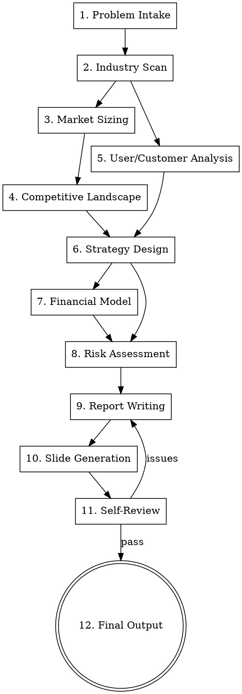

# Biz Analysis Pro — Multi-Agent Business Competition Skill

Orchestrate a team of specialist subagents to solve a complete business analysis competition: industry research, competitive landscape, strategy design, financial modeling, and report generation.

**Core principle:** Data-driven + framework-structured. Every claim backed by data, every analysis structured by a recognized framework.

## Architecture

```
┌─────────────────┐
│   Orchestrator   │ (you, the main session)
└────────┬────────┘
         │ dispatches subagents
    ┌────┼────┬────────┬──────────┬────────┐
    ▼    ▼    ▼        ▼          ▼        ▼
┌──────┐┌──────┐┌────────┐┌──────────┐┌───────┐┌───────┐
│Scout ││Analyst││Strategist││Financier││Writer ││Reviewer│
│(情报) ││(分析) ││(策略)    ││(财务)   ││(写作) ││(审查)  │
└──────┘└──────┘└────────┘└──────────┘└───────┘└───────┘
```

## Pipeline



<HARD-GATE>
Every market size claim must cite a source (report name + year, or calculation method shown). No fabricated industry data.
Every financial projection must list assumptions explicitly.
</HARD-GATE>

## User Checkpoint Protocol

**This skill is interactive, not auto-pilot.** At every major decision point, STOP and ask the user. Present your recommendation as default, but let the user override.

**Default rule:** If the user says "随便"、"都行"、"你定"、"不知道"、"默认吧", proceed with your recommended option. Do NOT keep asking — just go.

Checkpoints marked with 🔒 are MANDATORY stops (must wait for user response before proceeding).

| # | Checkpoint | When | What to ask |
|---|-----------|------|-------------|
| 🔒1 | **Problem Understanding** | After Stage 1 | "我理解这道题的核心是X，行业是Y，需要回答Z个问题。对吗？有补充吗？" |
| 🔒2 | **Industry Scope** | After Stage 2 | "调研发现行业规模¥X亿，主要趋势是A/B/C。分析范围是大了还是小了？" |
| 🔒3 | **Strategy Direction** | Before Stage 6 | "基于调研，我看到2-3个策略方向：①XX ②YY ③ZZ。我推荐①因为...。你选哪个？或者有自己的想法？" |
| 🔒4 | **Financial Assumptions** | Before Stage 7 | 列出所有关键假设（增长率、ARPU、成本等），让用户确认或调整数值 |
| 🔒5 | **Draft Review** | After Stage 9 | "初稿写完了，核心结论是X。你先看看，有什么要改的？" |
| 🔒6 | **Final Sign-off** | After Stage 11 | "自审通过，10项全PASS。最终交付report.md + slides。确认可以交付吗？" |

## Checklist

You MUST create a task for each item and complete them in order:

1. **Problem Intake** — read case/problem, identify industry, company, core questions
2. **Industry Scan** — dispatch Scout subagent for web research
3. **Market Sizing** — calculate TAM/SAM/SOM with cited sources
4. **Competitive Landscape** — Porter's 5 Forces + competitor matrix
5. **Customer Analysis** — personas, pain points, journey map
6. **Strategy Design** — business model + go-to-market plan
7. **Financial Model** — 3-5 year projections, break-even, ROI
8. **Risk Assessment** — risk matrix + mitigation strategies
9. **Report Writing** — write each section with evidence
10. **Slide Generation** — create presentation deck (optional, use guizang-ppt-skill)
11. **Self-Review** — dispatch Reviewer subagent with rubric
12. **Final Output** — assemble report + slides

## Stage Details

### Stage 1: Problem Intake

- Extract problem text from PDF/DOCX using markitdown or Read
- Identify: industry, company name (if any), core business questions, available data
- Determine output requirements: report only? report + slides? report + financial model Excel?
- Save to `work_dir/problem.md`

**🔒 Checkpoint 1 — Confirm Understanding**

Present to user:
```
我读完题了，确认一下理解：
- 行业: {industry}
- 核心问题: {question_1}, {question_2}, {question_3}
- 可用数据: {data_files}
- 输出要求: 报告 / 报告+PPT / 报告+财务模型

理解对吗？有要补充或纠正的吗？
```
Wait for user response. Adjust if needed, then proceed.

### Stage 2: Industry Scan (Actor-Critic x2)

Dispatch **Scout** subagent:

```
You are a senior industry researcher. Research this industry thoroughly.

Industry: {industry_name}
Country/Region: {region}
Time period: {years}

Find and summarize:
1. Industry overview — what does this industry do? value chain?
2. Market size (latest year, cite source)
3. Growth rate (past 3-5 years, cite source)
4. Key drivers and trends (technology, policy, demographic shifts)
5. Major players and market share
6. Recent notable events (M&A, regulation changes, tech breakthroughs)
7. Future outlook (analyst predictions, consensus forecast)

Use WebSearch to find:
- Industry reports (iResearch, Analysys, McKinsey, BCG, Statista)
- News articles (36kr, Huxiu, LatePost for Chinese market)
- Government statistics (National Bureau of Statistics)
- Company annual reports / IPO prospectuses

Cite every data point: [Source Name, Year]
```

Then **Critic** reviews:

**🔒 Checkpoint 2 — Scope Check**

After industry scan completes, present to user:
```
行业调研完成，核心发现：
- 市场规模: ¥X亿 (来源)
- 增长率: Y% (来源)
- 核心趋势: ①... ②... ③...
- 主要玩家: A(份额X%), B(份额Y%)

分析范围需要调整吗？还是可以继续深挖？
```
```
Review this industry research. Check:
1. Are all data points cited with sources?
2. Are sources credible (not random blogs)?
3. Is the industry scope correct (not too broad/narrow)?
4. Any missing segments or sub-sectors?
5. Any contradictions between sources?

Return specific issues or "PASS".
```

### Stage 3: Market Sizing

Dispatch **Analyst** subagent. Read `references/market-sizing-methods.md` first.

```
Calculate the market size for {target_segment} in {region}.

Use both methods for cross-validation:
1. Top-down: industry report total → segment percentage
2. Bottom-up: target users × penetration rate × ARPU

Show all calculations step by step.
Present TAM / SAM / SOM with clear assumptions.
```

Output: `work_dir/market_sizing.md` with:
- TAM, SAM, SOM in a table
- Calculation steps
- Source citations
- Sensitivity range (optimistic / base / pessimistic)

### Stage 4: Competitive Landscape

Dispatch **Analyst** subagent:

```
Analyze the competitive landscape for {company/segment}.

Produce:
1. Porter's Five Forces analysis — rate each force (High/Med/Low) with justification
2. Competitor matrix (table):

| Competitor | Revenue | Market Share | Strengths | Weaknesses | Strategy |
|------------|---------|-------------|-----------|------------|----------|
| ... | ... | ... | ... | ... | ... |

3. Positioning map — describe X/Y axes for a 2x2 competitive positioning chart
4. Strategic gaps — where are the underserved segments?
```

Generate positioning map figure using `references/biz-charts.md`.

### Stage 5: Customer Analysis

```
Analyze the target customers for {product/service}.

Produce:
1. Customer personas (2-3 personas):
   - Demographics
   - Goals and motivations
   - Pain points and frustrations
   - Buying behavior

2. Customer journey map:
   Awareness → Consideration → Purchase → Retention → Advocacy
   (touchpoints, emotions, pain points at each stage)

3. Jobs-to-be-Done framework:
   What jobs are customers hiring this product/service to do?

4. Willingness to pay analysis (if data available)
```

### Stage 6: Strategy Design (Actor-Critic x3)

**🔒 Checkpoint 3 — Strategy Direction**

Before dispatching Strategist, present options to user:
```
基于前面的调研和竞品分析，我看到2-3个可行策略方向：

方向①: {name} — {brief}
  优势: ...
  风险: ...

方向②: {name} — {brief}
  优势: ...
  风险: ...

方向③: {name} — {brief}
  优势: ...
  风险: ...

我推荐方向①，因为...
你选哪个？或者有别的想法？
```

Dispatch **Strategist** subagent with user's chosen direction. Read `references/biz-frameworks.md` for framework reference.

```
Design a business strategy for {company/product} based on:

Industry research: {industry_scan_summary}
Market size: {market_sizing_summary}
Competitive landscape: {competition_summary}
Customer analysis: {customer_summary}

Produce:
1. Business Model Canvas — 9 blocks, each with 3-5 bullet points
2. Revenue model — how does it make money? (subscription, transaction, advertising, etc.)
3. Go-to-market strategy — acquisition channels, growth loop, milestones
4. Differentiation — what makes this defensible? (network effects, switching costs, brand, data moat)
5. Strategic recommendations — 3-5 prioritized actions with expected impact

Justify every choice with evidence from the research above.
```

Critic checks:
- Is the revenue model realistic for this industry?
- Does differentiation hold up against competitors?
- Are growth assumptions reasonable?
- Any logical contradictions?

### Stage 7: Financial Model

**🔒 Checkpoint 4 — Financial Assumptions**

Before running the model, present assumptions to user:
```
财务模型的关键假设，请确认或调整：

| 假设项 | 默认值 | 你的值 |
|--------|--------|--------|
| 起始用户数 | {N} | ? |
| 月增长率 | {X}% | ? |
| 月流失率 | {Y}% | ? |
| 月ARPU | ¥{Z} | ? |
| 月固定成本 | ¥{A} | ? |
| 单用户月变动成本 | ¥{B} | ? |
| 初始投资 | ¥{C} | ? |

不确定的项保持默认即可。确认后我开始跑财务预测。
```

Dispatch **Financier** subagent with confirmed assumptions:

```
Build a financial model for {company/product}.

Strategy: {strategy_summary}
Market size: {market_sizing}
Pricing: {pricing_assumptions}

Produce a 3-5 year projection (annual):

## Assumptions (ALL listed explicitly)
- Starting users/customers: N
- Monthly growth rate: X%
- Monthly churn rate: Y%
- ARPU: ¥Z/month
- Fixed costs: ¥A/month
- Variable cost per user: ¥B
- One-time investments: ¥C

## Revenue Projection
| Year | Users | Revenue | COGS | Gross Profit | Gross Margin |
|------|-------|---------|------|-------------|-------------|
| Y1   |       |         |      |             |             |
| Y2   |       |         |      |             |             |
| Y3   |       |         |      |             |             |

## Profitability
- Break-even point: Month X, when users reach N
- Net income by year
- Cumulative cash flow

## Key Metrics
- CAC (Customer Acquisition Cost)
- LTV (Lifetime Value)
- LTV/CAC ratio
- Payback period
- IRR (if applicable)

## Sensitivity Analysis
- Optimistic / Base / Pessimistic scenarios
- What if growth is 50% of assumption?
- What if churn doubles?
```

Write and execute a Python script for the model. Save to `work_dir/scripts/financial_model.py`.

### Stage 8: Risk Assessment

```
Identify and assess risks for {strategy}.

Risk categories:
1. Market risk — demand uncertainty, competition response
2. Operational risk — execution challenges, talent
3. Financial risk — cash flow, funding
4. Regulatory risk — policy changes, compliance
5. Technology risk — tech failure, obsolescence

For each risk:
- Probability: High/Med/Low
- Impact: High/Med/Low
- Mitigation strategy: specific actions

Present as risk matrix + mitigation table.
```

### Stage 9: Report Writing (per section, parallel when possible)

Read `references/report-template.md` for structure.

Dispatch **Writer** subagent per section:

```
You are a senior business consultant writing a competition report.
Write the [{section_name}] section.

Context: {relevant_research_results}
Data/figures to reference: {figure_paths}
Preceding sections summary: {previous_sections}

Requirements:
1. Professional consulting tone — clear, data-driven, actionable
2. Every claim backed by data or clearly labeled as assumption
3. Reference figures: "如图X所示" or "Figure X shows"
4. Tables for comparisons and metrics
5. No filler — every sentence adds value
6. 300-500 words per main section (longer for strategy)
```

### Stage 10: Slide Generation (optional)

**🔒 Checkpoint 5 — Draft Review**

After report writing completes, present summary to user:
```
报告初稿完成！核心结论：

1. {finding_1}
2. {finding_2}
3. {finding_3}

主要建议: {recommendations}

报告在 work_dir/report/report.md
图表在 work_dir/figures/

你看看有没有要改的？比如：
- 某个分析方向要深挖？
- 某个结论你不认同？
- 要加/删某个图表？
- 风格/语气要调整？

没问题的话我就做PPT + 最终审查了。
```

If slides needed, use `guizang-ppt-skill` or dispatch Artist subagent:

```
Create a presentation deck for this business analysis.

Report summary: {executive_summary}
Key figures: {figure_list}
Number of slides: 12-15

Structure:
1. Cover slide
2. Executive Summary (key findings + recommendations)
3-4. Industry & Market Analysis
5-6. Competitive Landscape
7-8. Customer Insights
9-10. Strategy & Business Model
11-12. Financial Projections
13. Risk Assessment
14. Conclusion & Next Steps
15. Appendix (optional)
```

### Stage 11: Self-Review

```
Review this business analysis report against competition scoring criteria.

Report: {full_report}
Figures: {figure_manifest}
Financial model: {financial_summary}

Check each item — PASS/FAIL with explanation:

1. **Problem coverage** — All subtasks/questions addressed?
2. **Data quality** — All market data cited? Sources credible?
3. **Analytical depth** — Frameworks applied correctly? Surface-level or deep?
4. **Strategy coherence** — Does strategy follow from analysis? Logic gaps?
5. **Financial rigor** — Assumptions explicit? Model internally consistent?
6. **Actionability** — Can recommendations actually be implemented?
7. **Figure quality** — Charts clear, labeled, referenced in text?
8. **Writing quality** — Professional tone? No redundancy?
9. **Risk awareness** — Realistic risk assessment? Mitigation practical?
10. **Overall coherence** — Does the full report tell one consistent story?

Return: itemized results + required fixes.
```

Max 2 review rounds.

**🔒 Checkpoint 6 — Final Sign-off**

```
自审通过，10项检查全部PASS ✅

最终交付物：
- 📄 报告: work_dir/report/report.md
- 📊 图表: work_dir/figures/ (X张)
- 📈 财务模型: work_dir/scripts/financial_model.py
- 📑 PPT: work_dir/report/slides.html (如已生成)

需要转成DOCX或PDF吗？确认可以交付？
```

```
work_dir/
├── problem.md
├── industry_scan.md
├── market_sizing.md
├── competitive_analysis.md
├── customer_analysis.md
├── strategy.md
├── financial_model.py
├── financial_results.json
├── risk_assessment.md
├── figures/
│   ├── market_size_waterfall.png
│   ├── competitor_positioning.png
│   ├── revenue_projection.png
│   ├── risk_matrix.png
│   └── ...
├── report/
│   ├── report.md          (complete report)
│   └── slides.html        (optional, via guizang-ppt-skill)
└── scripts/
    └── financial_model.py
```

Optionally convert report to DOCX via `huashu-md-html` skill.

## Common Mistakes

| Mistake | Fix |
|---------|-----|
| Market size without source | Always cite: "[艾瑞咨询, 2024]" or show bottom-up calc |
| "市场规模很大" without number | Always give specific number + unit + year |
| Strategy disconnected from analysis | Every recommendation must trace back to a finding |
| Financial projections with no assumptions | List ALL assumptions in a table before projections |
| Copying Porter's 5 Forces template without analysis | Each force needs industry-specific evidence, not generic text |
| Ignoring unit economics | Show CAC, LTV, LTV/CAC ratio, payback period |
| Risk section as afterthought | Risk matrix should influence strategy choices |
