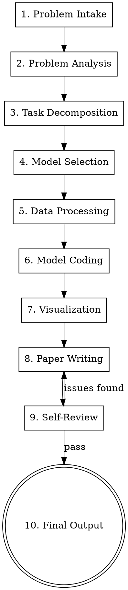

# MathModel Pro — Multi-Agent Math Modeling Skill

Orchestrate a team of specialist subagents to solve a complete math modeling competition problem end-to-end: problem analysis, model selection, data processing, code execution, visualization, and paper writing.

**Core principle:** Actor-Critic iteration at every stage. Never accept first-draft output — each role generates, reviews, and improves.

## Architecture

```
┌─────────────┐
│  Orchestrator │ (you, the main session)
└──────┬──────┘
       │ dispatches subagents
       ▼
┌──────────┐ ┌────────┐ ┌────────┐ ┌────────┐ ┌────────┐
│ Analyst  │ │ Modeler│ │ Coder  │ │ Artist │ │ Writer │
│ (问题分析)│ │ (建模) │ │ (编程) │ │ (图表) │ │ (论文) │
└──────────┘ └────────┘ └────────┘ └────────┘ └────────┘
```

Each box is a **subagent** dispatched via the Agent tool with a focused prompt. They never share session state — you pass them exactly what they need.

## Pipeline



<HARD-GATE>
Do NOT skip stages. Do NOT merge stages. Each stage produces an artifact that the next stage consumes. If a stage fails, iterate within that stage before proceeding.
</HARD-GATE>

## User Checkpoint Protocol

**This skill is interactive.** At every major decision point, STOP and confirm with the user.

**Default rule:** If user says "随便"、"都行"、"你定"、"不知道"、"默认吧", proceed with your recommended option.

| # | Checkpoint | When | What to ask |
|---|-----------|------|-------------|
| 🔒1 | **Problem Understanding** | After Stage 1 | "题目拆解为X个子问题，数据Y个文件，需要建立Z类模型。对吗？" |
| 🔒2 | **Analysis + Model Selection** | After Stage 4 | "针对每题，我选了：q1用XX模型，q2用YY模型...。你觉得合适吗？要换吗？" |
| 🔒3 | **Coding Results** | After Stage 6 (each subtask) | "qN跑完了，结果是X。数值看起来合理吗？" |
| 🔒4 | **Draft Review** | After Stage 8 | "论文初稿写完了，摘要核心结论是...。你看看要改什么？" |
| 🔒5 | **Final Sign-off** | After Stage 9 | "自审通过，论文+图表+代码都齐了。确认交付？" |

## Checklist

You MUST create a task for each item and complete them in order:

1. **Problem Intake** — read problem PDF/doc, extract problem text and data files
   - 🔒 **Checkpoint 1**: Confirm problem understanding with user
2. **Problem Analysis** — dispatch Analyst subagent with actor-critic (3 rounds)
3. **Task Decomposition** — break into subtasks, build DAG of dependencies
4. **Model Selection** — for each subtask, consult `references/model-knowledge-base.md`
   - 🔒 **Checkpoint 2**: Present model choices, get user confirmation
5. **Data Processing** — run `scripts/data_profile.py`, clean data, save processed files
6. **Model Coding** — dispatch Coder subagent per subtask (respect DAG order)
   - 🔒 **Checkpoint 3**: After each subtask, confirm results look reasonable
7. **Visualization** — dispatch Artist subagent, consult `references/visualization-guide.md`
8. **Paper Writing** — dispatch Writer subagent per section, consult `references/paper-template.md`
   - 🔒 **Checkpoint 4**: Present draft summary, get user feedback
9. **Self-Review** — dispatch Reviewer subagent with rubric checklist
   - 🔒 **Checkpoint 5**: Confirm final delivery
10. **Final Output** — assemble complete paper, verify all figures render

## Stage Details

### Stage 1: Problem Intake

- Use markitdown or Read tool to extract problem text from PDF/DOCX/PPTX
- Identify all attached data files (CSV, Excel, etc.)
- Save problem text to `work_dir/problem.md`
- Record: competition year, problem letter (A/B/C/D/E/F), number of subtasks

### Stage 2: Problem Analysis (Actor-Critic x3)

Dispatch **Analyst** subagent with this prompt pattern:

```
You are an expert mathematical modeling analyst. Analyze this competition problem.

Problem text:
{problem_text}

Data description:
{data_profile_output}

Produce:
1. Problem background and real-world context
2. Core objectives for each subtask
3. Available data and constraints
4. Key assumptions to consider
```

Then dispatch **Critic** subagent to review the analysis:

```
Review this problem analysis for a math modeling competition.
Check: are any subtask objectives missed? Any wrong assumptions?
Any logical gaps? Any overlooked data constraints?

Problem text:
{problem_text}

Analysis to review:
{analyst_output}

Return: list of specific issues, or "PASS" if solid.
```

If issues found, feed critique back to Analyst for improvement. **Repeat 3 rounds minimum.**

### Stage 3: Task Decomposition + DAG

Identify subtasks (usually q1, q2, q3, q4). For each, determine:
- Which subtasks depend on results from others?
- Can any run in parallel?

Build a dependency DAG. Example:

```
q1 (data analysis) → q2 (model building, depends on q1)
q1 → q3 (validation, depends on q1 and q2)
q4 (sensitivity) depends on q2
```

Save DAG to `work_dir/task_dag.json`:
```json
{
  "q1": {"depends": [], "description": "..."},
  "q2": {"depends": ["q1"], "description": "..."},
  "q3": {"depends": ["q1", "q2"], "description": "..."}
}
```

Process subtasks in topological order. Independent subtasks can be dispatched in parallel.

### Stage 4: Model Selection

For each subtask, read `references/model-knowledge-base.md` and select appropriate models.

Dispatch **Modeler** subagent:

```
You are an expert mathematical modeler. For this subtask:

Subtask: {subtask_description}
Data available: {data_summary}
Previous subtask results: {dependency_results}

Select 2-3 candidate models with justification:
1. Primary model — best fit for this problem type
2. Validation model — for cross-validation or comparison
3. Backup model — simpler alternative if primary fails

For each model, specify:
- Mathematical formulation (key equations)
- Required input data
- Expected output
- Strengths and limitations
- Python implementation approach (which libraries)
```

Apply actor-critic (Modeler generates, Critic reviews, 2 rounds).

### Stage 5: Data Processing

1. Run data profiling:
```bash
python scripts/data_profile.py {data_file} -o work_dir/data_profile.md
```

2. Dispatch Coder subagent for data cleaning:
```
You are a data engineer. Clean and prepare this dataset for modeling.

Data profile: {read work_dir/data_profile.md}
Requirements from modeler: {model_input_requirements}

Write a Python script that:
1. Handles missing values (document strategy)
2. Handles outliers (document strategy)
3. Feature engineering if needed
4. Saves processed data to work_dir/processed/
5. Outputs a brief data summary

Save as work_dir/scripts/data_clean.py, then execute it.
```

### Stage 6: Model Coding (per subtask, DAG order)

Dispatch **Coder** subagent for each subtask:

```
You are a numerical computing expert. Implement the model for this subtask.

Subtask: {subtask_description}
Model selected: {model_specification}
Data: {processed_data_path}
Dependency results: {results_from_previous_subtasks}

Write a complete, self-contained Python script that:
1. Loads processed data
2. Implements the mathematical model
3. Solves/optimizes/simulates
4. Outputs results to work_dir/results/q{N}/
5. Generates key numerical results as JSON for paper writer

CRITICAL:
- Use deterministic random seeds (np.random.seed(42))
- Handle edge cases (empty data, singular matrices, non-convergence)
- Add timing code to measure computation time
- Save all intermediate results for reproducibility
- Print clear output showing: method used, parameters, key results, execution time
```

After coding, **execute the script** via Bash. If it fails:
1. Read error output
2. Fix the specific issue
3. Re-execute
4. Repeat until success (max 3 attempts per error type)

<HARD-GATE>
Never fabricate results. If code execution fails after 3 attempts, report failure honestly and try the backup model. Do NOT proceed with fake numbers.
</HARD-GATE>

### Stage 7: Visualization

Dispatch **Artist** subagent. First read `references/visualization-guide.md`.

```
You are a data visualization expert creating figures for an academic paper.

Results: {model_results}
Context: {subtask_description}

Create publication-quality figures. Requirements:
1. Use matplotlib with seaborn style OR plotly for interactive
2. Font size >= 12 for all labels, >= 14 for titles
3. DPI >= 300 for saved figures
4. Save as both PNG and PDF (vector)
5. Use colorblind-friendly palettes (e.g., 'Set2', 'viridis')
6. Each figure tells ONE clear story
7. Include proper axis labels, units, and legends

Save to work_dir/figures/ with descriptive filenames.
Output a manifest: which figure goes in which paper section.
```

Common figure types by model category:
- **Optimization**: convergence curve, solution space heatmap, Pareto front
- **Statistical**: distribution plot, QQ plot, residual analysis, correlation matrix
- **Time series**: forecast vs actual, decomposition, anomaly highlights
- **Classification/Clustering**: confusion matrix, cluster scatter, silhouette plot
- **Network**: graph visualization, community detection, centrality heatmap
- **Sensitivity**: tornado diagram, spider plot, parameter sweep heatmap

### Stage 8: Paper Writing

Read `references/paper-template.md` for structure.

Dispatch **Writer** subagent **per section** (sections can be parallel if independent):

```
You are an academic paper writer specializing in mathematical modeling competitions.
Write the following section in Chinese (for CUMCM) or English (for MCM/ICM).

Section: {section_name}
Content to cover: {analysis_results, model_description, code_results, figures}
Figures to include: {figure_paths}
Preceding sections summary: {previous_sections_brief}

Requirements:
1. Formal academic tone, concise and precise
2. Mathematical notation in LaTeX ($$...$$ for display, $...$ for inline)
3. Reference figures as "图1", "图2" etc. or "Figure 1", "Figure 2"
4. Tables for numerical comparisons
5. Every claim backed by either assumption, data, or calculation result
6. No filler sentences. Every sentence adds information.
```

**Section order:**
1. Abstract (摘要) — write LAST, summarizes everything
2. Problem Restatement (问题重述)
3. Assumptions (模型假设)
4. Notation (符号说明)
5. For each subtask: Model Setup → Solution → Results
6. Sensitivity Analysis (灵敏度分析)
7. Model Evaluation (模型评价: strengths + weaknesses)
8. References (参考文献)

### Stage 9: Self-Review

Dispatch **Reviewer** subagent with this rubric:

```
Review this mathematical modeling paper against competition scoring criteria.

Paper: {full_paper_text}
Figures: {figure_manifest}
Code results: {results_summary}

Check each item. For each, rate PASS/FAIL and explain:

1. **Problem understanding** — Are all subtasks addressed? Any missed?
2. **Model correctness** — Are mathematical formulations sound? Any logical errors?
3. **Model justification** — Is model choice justified? Why this model and not another?
4. **Results validity** — Do results make sense? Are units correct? Are numbers realistic?
5. **Figure quality** — Are figures clear, labeled, and referenced in text?
6. **Paper structure** — Does it follow standard format? Is the abstract self-contained?
7. **Writing quality** — Is it concise? Any redundancy? Any unsupported claims?
8. **Sensitivity analysis** — Is it present? Does it test meaningful parameter ranges?
9. **Reproducibility** — Could someone reproduce results from the description?
10. **Innovation** — Does the approach show insight beyond textbook methods?

Return: itemized pass/fail list, and a list of specific required fixes.
```

If any FAIL items, loop back to Stage 8 for those sections. Max 2 review rounds.

### Stage 10: Final Output

Assemble into final paper:
- `work_dir/paper/paper.md` — complete Markdown paper with embedded LaTeX
- `work_dir/paper/figures/` — all figures
- `work_dir/paper/references.bib` — bibliography
- `work_dir/code/` — all scripts, organized by subtask
- `work_dir/results/` — all numerical results

Optionally, use huashu-md-html skill to convert to styled HTML or DOCX.

## Parallelization Strategy

When subtasks are independent in the DAG, dispatch their Coders in parallel using multiple Agent tool calls in one message:

```
Agent 1 → Coder for q1 (data analysis)
Agent 2 → Coder for q4 (literature review, if independent)
```

When they share dependencies, run sequentially.

## Common Mistakes

| Mistake | Fix |
|---------|-----|
| Using KMeans on non-spherical data without justification | Check data distribution first, consider DBSCAN/GMM |
| Reporting R² without cross-validation | Always use k-fold CV for statistical models |
| Forgetting to set random seeds | `np.random.seed(42)` at top of every script |
| Vague model descriptions ("we used machine learning") | Specify exact algorithm, hyperparameters, feature engineering |
| Figures too small or unlabeled | Follow visualization guide: font>=12, DPI>=300 |
| Copying model formulas without adapting to problem | Always show how general formula maps to specific problem variables |
| Skipping sensitivity analysis | Always vary key parameters ±10%, ±20%, ±50% |

## File Organization

```
work_dir/
├── problem.md              # Extracted problem text
├── task_dag.json           # Subtask dependency graph
├── data_profile.md         # Data profiling report
├── raw_data/               # Original data files
├── processed/              # Cleaned data
├── scripts/
│   ├── data_clean.py
│   ├── q1_model.py
│   ├── q2_model.py
│   └── q3_model.py
├── results/
│   ├── q1/
│   ├── q2/
│   └── q3/
├── figures/
│   ├── q1_convergence.png
│   ├── q2_heatmap.png
│   └── sensitivity_tornado.png
└── paper/
    ├── paper.md
    ├── figures/            # Paper-ready figures
    └── references.bib
```
